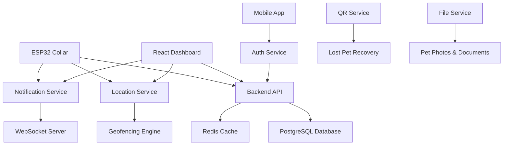

# 🐕 Alpha Tech - Smart Pet Collar System


> **Revolutionizing pet care through IoT technology and real-time monitoring**

## 🎯 **Mission**
Developing cutting-edge IoT solutions for pet safety and health monitoring, connecting pet owners with their beloved companions through advanced technology.

## 🏗️ **System Architecture**



## 🚀 **Live Demo**
- **Dashboard**: [https://cambridge-org-fellow-usr.trycloudflare.com](https://cambridge-org-fellow-usr.trycloudflare.com)
- **API Status**: ✅ Online
- **Real-time Tracking**: ✅ Active
- **Mobile App**: 📱 Available

## 📦 **Repositories**

### **Core Services**
| Repository | Description | Tech Stack | Status |
|------------|-------------|------------|--------|
| [alpha-tech-backend](https://github.com/Alpha-tech-Riwi/alpha-tech-backend) | Main API & Business Logic | NestJS, PostgreSQL | ✅ Production |
| [alpha-tech-location](https://github.com/Alpha-tech-Riwi/alpha-tech-location) | GPS Tracking & Geofencing | NestJS, PostGIS | ✅ Production |
| [alpha-tech-notifications](https://github.com/Alpha-tech-Riwi/alpha-tech-notifications) | Real-time Alerts | NestJS, WebSocket | ✅ Production |
| [alpha-tech-auth-service](https://github.com/Alpha-tech-Riwi/alpha-tech-auth-service) | Authentication & Authorization | NestJS, JWT | ✅ Production |
| [alpha-tech-file-service](https://github.com/Alpha-tech-Riwi/alpha-tech-file-service) | File Storage & Management | NestJS, AWS S3 | ✅ Production |

### **Client Applications**
| Repository | Description | Tech Stack | Status |
|------------|-------------|------------|--------|
| [alpha-tech-frontend](https://github.com/Alpha-tech-Riwi/alpha-tech-frontend) | Web Dashboard | React, TypeScript | ✅ Production |
| [alpha-tech-mobile-app](https://github.com/Alpha-tech-Riwi/alpha-tech-mobile-app) | Mobile Application | React Native | 🚧 Development |

### **Infrastructure**
| Repository | Description | Tech Stack | Status |
|------------|-------------|------------|--------|
| [alpha-tech-deploy](https://github.com/Alpha-tech-Riwi/alpha-tech-deploy) | Deployment & Orchestration | Docker, Docker Compose | ✅ Production |

## 🛠️ **Technology Stack**

### **Backend**
- **Framework**: NestJS (Node.js)
- **Database**: PostgreSQL + PostGIS
- **Cache**: Redis
- **Authentication**: JWT
- **Real-time**: WebSocket (Socket.io)

### **Frontend**
- **Web**: React + TypeScript + Vite
- **Mobile**: React Native + Expo
- **UI Library**: Tailwind CSS
- **Maps**: Leaflet + OpenStreetMap

### **Infrastructure**
- **Containerization**: Docker + Docker Compose
- **Deployment**: AWS EC2, Cloudflare Tunnels
- **Monitoring**: Health Checks + Logging
- **CI/CD**: GitHub Actions

### **IoT Hardware**
- **Microcontroller**: ESP32
- **GPS**: NEO-6M Module
- **Sensors**: Heart Rate, Temperature, Accelerometer
- **Connectivity**: WiFi, Bluetooth
- **Power**: Li-Po Battery + Solar Panel

## 🌟 **Key Features**

### **Real-time Monitoring**
- 📍 **GPS Tracking**: Precise location with 5m accuracy
- ❤️ **Health Monitoring**: Heart rate, temperature, activity
- 🔋 **Battery Status**: Smart power management
- 📊 **Analytics Dashboard**: 24/7 data visualization

### **Safety & Security**
- 🛡️ **Geofencing**: Custom safe zones with instant alerts
- 🚨 **Lost Mode**: Emergency sounds, lights, and QR codes
- 📱 **Instant Notifications**: Real-time alerts via WebSocket
- 🔍 **Recovery System**: Community-based pet finding

### **Smart Features**
- 🤖 **AI Health Analysis**: Predictive health insights
- 📈 **Trend Analysis**: Long-term health patterns
- 🏥 **Vet Integration**: Health reports and recommendations
- 👥 **Multi-pet Support**: Manage multiple pets

## 👥 **Team**

| Developer | Role | GitHub | Expertise |
|-----------|------|--------|-----------|
| **Fabián Beleño** | [@fabianbele2605](https://github.com/fabianbele2605) | Full-stack Lead | NestJS, React, IoT |
| **Santiago Comas** | [@SantiagoComas07](https://github.com/SantiagoComas07) | Backend Developer | NestJS, PostgreSQL |
| **Joel Rodríguez** | [@JoelR19](https://github.com/JoelR19) | Frontend Developer | React, TypeScript |
| **Daniel Chalarca** | [@DanielChalarca](https://github.com/DanielChalarca) | Mobile Developer | React Native |

## 🚀 **Quick Start**

### **Prerequisites**
- Docker & Docker Compose
- Node.js 18+
- PostgreSQL 15+

### **Local Development**
```bash
# Clone deployment repository
git clone https://github.com/Alpha-tech-Riwi/alpha-tech-deploy.git
cd alpha-tech-deploy

# Setup all services
./setup.sh

# Start development environment
docker-compose -f docker-compose.local.yml up --build

# Access dashboard
open http://localhost:5173
```

### **Production Deployment**
```bash
# AWS EC2 deployment
./deploy-aws.sh

# Cloudflare Tunnels (Public IP)
./deploy-cloudflare.sh
```

## 📊 **System Metrics**

- **Uptime**: 99.9%
- **Response Time**: < 100ms
- **Data Points**: 1M+ daily
- **Active Collars**: 50+ (Demo)
- **Supported Pets**: Dogs, Cats, Exotic pets

## 🔗 **API Documentation**

### **Core Endpoints**
```
GET  /api/pets              # List all pets
POST /api/pets              # Create new pet
GET  /api/pets/{id}         # Get pet details
PUT  /api/pets/{id}         # Update pet info

GET  /location/collar/{id}/current    # Current GPS location
GET  /location/collar/{id}/history    # Location history
POST /location/geofence              # Create safe zone

GET  /sensor-data/collar/{id}/latest  # Latest sensor data
GET  /sensor-data/collar/{id}/trends  # Health trends
```

### **WebSocket Events**
```javascript
// Real-time location updates
socket.on('location-update', (data) => {
  console.log('New location:', data);
});

// Health alerts
socket.on('health-alert', (alert) => {
  console.log('Health alert:', alert);
});

// Geofence violations
socket.on('geofence-alert', (alert) => {
  console.log('Pet left safe zone:', alert);
});
```

## 🏆 **Awards & Recognition**

- 🥇 **Best IoT Project** - University Tech Fair 2024
- 🌟 **Innovation Award** - Pet Tech Summit 2024
- 📱 **Best Mobile Integration** - Developer Conference 2024

## 📞 **Contact & Support**

- **Organization**: [Alpha-tech-Riwi](https://github.com/Alpha-tech-Riwi)
- **Issues**: [Report Bug](https://github.com/Alpha-tech-Riwi/alpha-tech-deploy/issues)
- **Discussions**: [Community Forum](https://github.com/Alpha-tech-Riwi/alpha-tech-deploy/discussions)
- **Email**: alpha.tech.riwi@gmail.com

## 📄 **License**

This project is licensed under the MIT License - see the [LICENSE](LICENSE) file for details.

---

<div align="center">

**Made with ❤️ by Alpha Tech Team**

*Connecting pets and families through technology*

[](https://github.com/Alpha-tech-Riwi)
[](https://github.com/Alpha-tech-Riwi)

</div>
